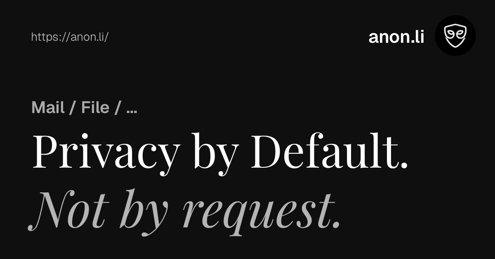

<p align="center">
  <a href="https://anon.li/?ref=github" target="_blank">
    
  </a>
</p>

<h3 align="center">Open-source email aliasing + zero-knowledge encrypted file sharing. Privacy by default.</h3>

<p align="center">
  <em>👋 Welcome! If you prefer a visual tour, check out our <a href="https://www.youtube.com/watch?v=J-cJT-3fp2o">2-minute intro video on YouTube</a>.</em>
</p>

<p align="center">
  <a href="https://www.gnu.org/licenses/agpl-3.0"></a>
  <a href="https://status.anon.li"></a>
  <a href="https://github.com/anondotli/anon.li/stargazers"></a>
</p>

---

## Why anon.li?

We built anon.li because we were tired of handing our sensitive files and real email addresses to black-box companies. 

- **Email aliases that protect your real inbox - without switching email providers.** Keep using Gmail, Proton, or Fastmail; we just sit in the middle and block the spam.
- **AES-256-GCM encrypted file sharing - we can't read your files, by design.** Your browser encrypts the file before it ever hits the network. The decryption key lives in the URL fragment, so it is never transmitted to our servers.
- **Fully open source (AGPL v3) - verify every claim yourself.** Don't just trust our marketing. You can audit our encryption logic, host it yourself, and own your data forever.

---

## Products

### Alias - Anonymous Email Forwarding
Create unique aliases for every service. Reply from your aliases without ever exposing your real identity. Emails pass through our servers in real-time and are **never** stored on disk.
* Up to 250 aliases (Pro)
* Anonymous replies via SRS
* Optional PGP encryption
* Custom domain support
* One-click disable to instantly stop spam

### Drop - End-to-End Encrypted File Sharing
Share files securely. Everything is encrypted in your browser using AES-256-GCM. 
* Zero-knowledge architecture
* Automatic expiration (1–30 days)
* Download limits and password protection
* Up to 250GB per transfer (Pro)
* No account required for the recipient to download

---

## Quick Start

Whether you prefer spinning up containers or running things natively, you can get anon.li running locally in a few minutes. 

*(Prerequisite for both: You will need a Cloudflare R2 bucket. See the [Cloudflare setup guide below](#one-time-cloudflare-r2-setup).)*

Installation requires [Bun](https://bun.sh) \>= 1.0, PostgreSQL, and Redis.

```bash
git clone https://github.com/anondotli/anon.li.git
cd anon.li
bun install
cp .env.example .env

# Generate the Prisma client and push the schema
bunx prisma generate
bunx prisma db push

# Start the development server
bun dev 
```

### One-time Cloudflare R2 setup

anon.li Drop uploads and downloads blob data directly between the browser and R2 to guarantee zero egress fees and avoid server-side relay bottlenecks.

1.  Create an R2 bucket and attach a custom domain (e.g., `r2.anon.li`) via the Cloudflare dashboard.
2.  Set `R2_PUBLIC_ENDPOINT=https://r2.anon.li` in your `.env`. The app refuses to start without this.
3.  Configure the bucket's CORS rules to allow direct browser interaction by running our helper script:
    ```bash
    bun run scripts/configure-r2-cors.ts
    ```
    *(This reads `CLOUDFLARE_ACCOUNT_ID`, `CLOUDFLARE_API_TOKEN`, and `R2_BUCKET_NAME` from your environment.)*

-----

## Comparison

| Feature | anon.li | SimpleLogin | addy.io | Firefox Relay |
|---|---|---|---|---|
| **Email aliases** | Up to 250 | Unlimited (paid) | Unlimited (paid) | 5 (free) / unlimited (paid) |
| **Anonymous replies** | Yes | Yes | Yes | No |
| **PGP encryption** | Yes | Yes | Yes | No |
| **Custom domains** | Yes (paid) | Yes (paid) | Yes (paid) | No |
| **E2EE file sharing** | Yes | No | No | No |
| **Zero-knowledge files** | Yes | N/A | N/A | N/A |
| **Download limits** | Yes | N/A | N/A | N/A |
| **File expiry controls** | Yes | N/A | N/A | N/A |
| **Open source** | Yes (AGPL) | Yes (acquired by Proton) | Yes | Partial |
| **Independent** | Yes | No (Proton) | Yes | No (Mozilla) |
| **Free tier** | 10 aliases + 5GB drops | 10 aliases | 10 aliases | 5 aliases |
| **Paid from** | $1.99/mo | $4/mo | $1/mo | $1.99/mo |

*See our detailed breakdown pages: [vs SimpleLogin](https://anon.li/compare/simplelogin) · [vs Proton](https://anon.li/compare/proton) · [vs WeTransfer](https://anon.li/compare/wetransfer)*

-----

## Tech Stack

**Next.js 16** (App Router) · **React 19** · **PostgreSQL** + **Prisma** · **Better Auth** (magic links + TOTP 2FA) · **Cloudflare R2** · **Stripe** · **Upstash Redis** · **Resend** · **Tailwind CSS** + **shadcn/ui**

## Links

  - **Live site**: [anon.li](https://anon.li)
  - **Security architecture**: [anon.li/security](https://anon.li/security)
  - **API docs**: [anon.li/docs/api](https://anon.li/docs/api)
  - **Contributing**: [CONTRIBUTING.md](https://www.google.com/search?q=CONTRIBUTING.md)
  - **Report vulnerabilities**: [security@anon.li](mailto:security@anon.li)

-----

## Legal & License

Jurisdiction: Liechtenstein · [Privacy Policy](https://anon.li/privacy) · [Terms](https://anon.li/terms) · [AUP](https://anon.li/docs/legal/aup) · [DMCA](https://anon.li/docs/legal/dmca)

**[GNU Affero General Public License v3.0](https://www.google.com/search?q=LICENSE)** - Copyright © 2026 anon.li.