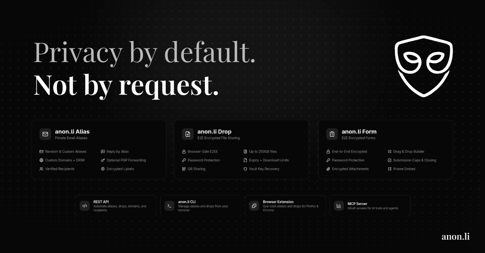

<p align="center">
  <a href="https://anon.li/?ref=github" target="_blank">
    
  </a>
</p>

<h3 align="center">Open-source email aliasing + zero-knowledge encrypted file sharing. Privacy by default.</h3>

<p align="center">
  <em>👋 Welcome! If you prefer a visual tour, check out our <a href="https://www.youtube.com/watch?v=J-cJT-3fp2o">2-minute intro video on YouTube</a>.</em>
</p>

<p align="center">
  <a href="https://www.gnu.org/licenses/agpl-3.0"></a>
  <a href="https://status.anon.li"></a>
  <a href="https://github.com/anondotli/anon.li"></a>
</p>

---

## Why anon.li?

We built anon.li because we were tired of handing our sensitive files and real email addresses to black-box companies. 

- **Email aliases that protect your real inbox - without switching email providers.** Keep using Gmail, Proton, or Fastmail; we just sit in the middle and block the spam.
- **AES-256-GCM encrypted file sharing - we can't read your files, by design.** Your browser encrypts the file before it ever hits the network. The decryption key lives in the URL fragment, so it is never transmitted to our servers.
- **Fully open source (AGPL v3) - verify every claim yourself.** Don't just trust our marketing. You can audit our encryption logic, host it yourself, and own your data forever.

---

## Products

### Alias - Anonymous Email Forwarding
Create unique aliases for every service. Reply from your aliases without ever exposing your real identity. Emails pass through our servers for forwarding instead of being stored in a hosted mailbox.
* 10 random + 1 custom alias on Free; unlimited random + 100 custom aliases on Pro
* Anonymous replies via SRS
* Optional PGP encryption per recipient
* Custom domain support on paid plans
* Encrypted labels and notes in your vault
* One-click disable to instantly stop spam

### Drop - End-to-End Encrypted File Sharing
Share files securely. Everything is encrypted in your browser using AES-256-GCM. 
* Zero-knowledge architecture
* Automatic expiration (1–30 days)
* Download limits and password protection
* File previews count as downloads because they expose full encrypted file bytes
* Up to 250GB per transfer (Pro)
* No account required for the recipient to download

---

## Quick Start

You can get anon.li running locally in a few minutes.

*(Prerequisite: You will need a Cloudflare R2 bucket. See the [Cloudflare setup guide below](#one-time-cloudflare-r2-setup).)*

Installation requires [Bun](https://bun.sh) \>= 1.2, PostgreSQL, and Redis.

```bash
git clone https://github.com/anondotli/anon.li.git
cd anon.li
bun install
cp .env.example .env

# Generate the Prisma client and push the schema
bunx prisma generate
bunx prisma db push

# Start the development server
bun dev 
```

Before opening a pull request, run the same checks enforced by CI:

```bash
bun run audit
bun run lint
bun run typecheck
bun run test
bun run build
```

### Production deployment

Production databases must be updated with the committed Prisma migrations. Do not use `prisma db push` in production; it bypasses the reviewed migration history.

```bash
bun install --frozen-lockfile
bun run build
bun run db:migrate:deploy
bun run start
```

Set every required variable documented in `.env.example` in the deployment platform, back up the database before applying migrations, and run `bun run db:migrate:deploy` once per release before starting the new application version. The build command regenerates the Prisma client automatically.

Client-IP rate limits trust one edge only. Vercel is detected automatically. On a self-hosted origin behind Cloudflare, set `TRUSTED_PROXY_PROVIDER=cloudflare` and restrict direct origin traffic to Cloudflare's network; otherwise forwarding headers are spoofable.

### One-time Cloudflare R2 setup

anon.li Drop uploads and downloads blob data directly between the browser and R2 via S3 presigned URLs, avoiding server-side relay bottlenecks. Download URLs are short-lived; multipart upload URLs are bound to an upload ID, part number, and exact encrypted byte length and last up to seven days so very large transfers can complete.

1. Create an R2 bucket and keep it private. Disable its public `r2.dev` URL and do not attach a public custom domain. Public object access would bypass Drop expiry, revocation, recipient, and download-limit checks.
2. Create R2 API credentials with object read/write access to that bucket, then set `R2_ACCESS_KEY_ID`, `R2_SECRET_ACCESS_KEY`, `R2_BUCKET_NAME`, and the account S3 API endpoint (`R2_ENDPOINT=https://<account_id>.r2.cloudflarestorage.com`) in `.env`.
3. Configure the bucket's CORS rules to allow `GET`, `HEAD`, and `PUT` from your application origin and expose the `ETag` response header. Browser transfers still go directly to R2; R2 does not charge internet egress fees.

Cloudflare presigned URLs are supported on the S3 API domain, not on custom domains. Treat private-bucket access as a security requirement, not only a deployment preference.

-----

## Comparison

| Feature | anon.li | SimpleLogin | addy.io | Firefox Relay |
|---|---|---|---|---|
| **Email aliases** | 10 random + 1 custom (free) / unlimited random + 100 custom (Pro) | Unlimited (paid) | Unlimited (paid) | 5 (free) / unlimited (paid) |
| **Anonymous replies** | Yes | Yes | Yes | No |
| **PGP encryption** | Yes | Yes | Yes | No |
| **Custom domains** | Yes (paid) | Yes (paid) | Yes (paid) | No |
| **E2EE file sharing** | Yes | No | No | No |
| **Zero-knowledge files** | Yes | N/A | N/A | N/A |
| **Download limits** | Yes | N/A | N/A | N/A |
| **File expiry controls** | Yes | N/A | N/A | N/A |
| **Open source** | Yes (AGPL) | Yes (acquired by Proton) | Yes | Partial |
| **Independent** | Yes | No (Proton) | Yes | No (Mozilla) |
| **Free tier** | 10 random aliases, 1 custom alias, 5GB Drop bandwidth | 10 aliases | 10 aliases | 5 aliases |
| **Paid from** | Alias $2.49/mo, Drop $2.99/mo, Bundle $3.99/mo | $4/mo | $1/mo | $1.99/mo |

*See our detailed breakdown pages: [vs SimpleLogin](https://anon.li/compare/simplelogin) · [vs Proton](https://anon.li/compare/proton) · [vs WeTransfer](https://anon.li/compare/wetransfer)*

-----

## Tech Stack

**Next.js 16** (App Router) · **React 19** · **PostgreSQL** + **Prisma** · **Better Auth** (magic links, email/password, TOTP 2FA) · **Cloudflare R2** · **Stripe** · **Upstash Redis** · **Resend** · **Tailwind CSS** + **shadcn/ui**

## Links

  - **Live site**: [anon.li](https://anon.li)
  - **Security architecture**: [anon.li/security](https://anon.li/security)
  - **API docs**: [anon.li/docs/api](https://anon.li/docs/api)
  - **Source code**: [github.com/anondotli/anon.li](https://github.com/anondotli/anon.li)
  - **Report vulnerabilities**: [security@anon.li](mailto:security@anon.li)

-----

## Legal & License

Jurisdiction: Liechtenstein · [Privacy Policy](https://anon.li/privacy) · [Terms](https://anon.li/terms) · [AUP](https://anon.li/docs/legal/aup) · [DMCA](https://anon.li/docs/legal/dmca)

**[GNU Affero General Public License v3.0](https://github.com/anondotli/anon.li/blob/main/LICENSE)** - Copyright © 2026 anon.li.
